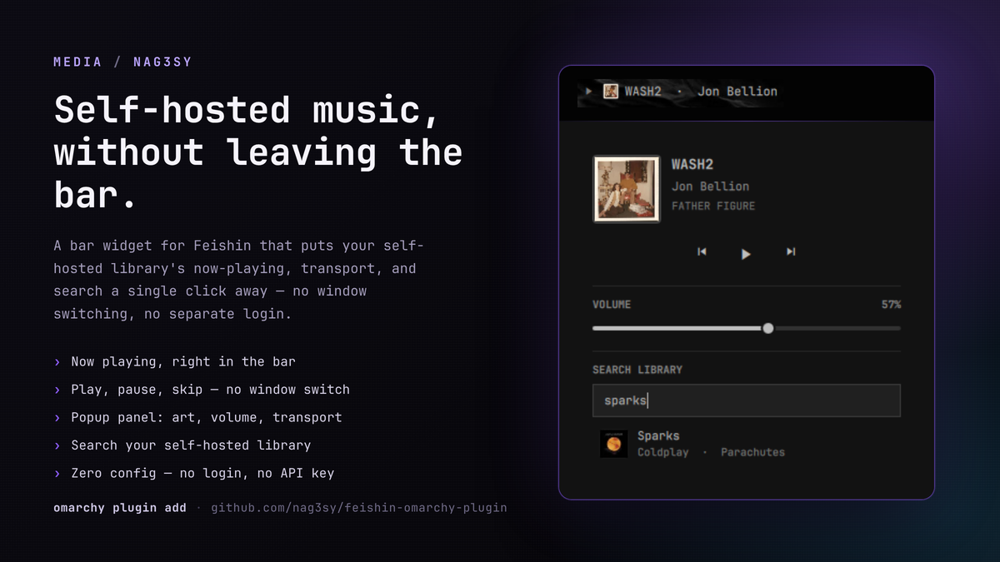
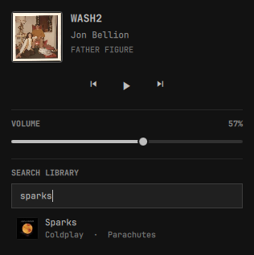

# Feishin for Omarchy



A bar-widget plugin for [Omarchy](https://omarchy.org/) that shows what's currently
playing in [Feishin](https://github.com/jeffvli/feishin) and lets you control it —
play/pause, skip, volume, and a quick library search — without switching to the
Feishin window.


## Why this exists

I self-host most of my own infrastructure, including my music library, and
Feishin is my client of choice for playing it back. But alt-tabbing into a
full player window just to skip a track or see what's playing felt like a lot
of friction for something that small. This widget puts my self-hosted
library's now-playing, transport, volume, and search a single click away in
the bar — no window switching, no separate login, no config file.

## Features

- **Now playing in the bar** — play/pause icon, mini album art, and a scrolling
  track name that never resizes the bar, however long the title is.
- **Transport controls** — click the icon to play/pause, middle-click or scroll
  over the track name to skip forward/back.
- **Popup panel** — click the art/track name to open a panel with full cover art,
  title/artist/album, and previous/play-pause/next buttons.
- **Volume slider** — drag to set Feishin's playback volume directly.
- **Library search** — search your music server's library from the popup and see
  matching songs with art, title, artist, and album.



- **Jump to Feishin** — clicking a search result, or the now-playing art/title,
  brings the Feishin window to the front and copies the track/album name to your
  clipboard so it's a paste away in Feishin's own search.
- **Zero configuration** — no login, server URL, or API key to enter. The widget
  reuses the same auth token Feishin's own MPRIS integration already exposes.

## Requirements

- [Omarchy](https://omarchy.org/) with its Quickshell-based shell.
- [Feishin](https://github.com/jeffvli/feishin) running on Linux, with its MPRIS
  integration enabled (this is Feishin's default behavior — nothing to turn on).
- `wl-copy` (part of `wl-clipboard`) for the clipboard bridge described above.
  Already present on a standard Omarchy install.
- A Subsonic/OpenSubsonic-compatible music server (e.g. Navidrome) for the
  library search feature. Transport controls (play/pause/skip/volume) work
  without one — search just won't be available until Feishin has loaded a
  track's cover art at least once, since that's where the widget reads the
  server's auth token from.

## Install

```sh
omarchy plugin add https://github.com/nag3sy/feishin-omarchy-plugin --enable
```

Or manually:

```sh
git clone https://github.com/nag3sy/feishin-omarchy-plugin \
  ~/.config/omarchy/plugins/io.github.nag3sy.feishin
omarchy-shell shell rescanPlugins
omarchy plugin enable io.github.nag3sy.feishin --section right
```

## Remove

```sh
omarchy plugin remove io.github.nag3sy.feishin
```

## How it works

Feishin registers itself on the session D-Bus as an
[MPRIS](https://specifications.freedesktop.org/mpris-spec/latest/) media player
(`org.mpris.MediaPlayer2.Feishin`) via its bundled `mpris-service` dependency.
This widget talks to that MPRIS player directly through Quickshell's built-in
`Quickshell.Services.Mpris` module for now-playing info, transport control, and
volume — no polling scripts or external processes involved.

For search, Feishin's cover-art URLs already embed a valid Subsonic-style auth
token for your music server (`u`, `t`, `s`, `v` query parameters). The widget
picks that up from the currently-loaded track's art URL and reuses it to query
your server's `search3` endpoint directly — the same server Feishin itself
talks to, with no separate login.

## Known limitation

There is currently no way for anything outside Feishin — this widget included —
to make a running Feishin instance start playing an arbitrary track. This was
confirmed by checking every external control surface Feishin exposes:

- MPRIS's `OpenUri` is declared but not wired to anything.
- Feishin's `feishin://` URI scheme only serves local font files internally.
- Feishin's own built-in Remote Control Server (Settings → General) only
  forwards transport commands (play/pause/next/previous/volume/etc.) over its
  WebSocket — no search, browse, or "play this track" event exists.

This is tracked upstream as
[jeffvli/feishin#1221](https://github.com/jeffvli/feishin/issues/1221). Until
Feishin adds a real remote-play API, "jump to Feishin" here means: bring the
window to the front and copy the track/album name to your clipboard, so
finding it in Feishin is a paste and a click away rather than a manual search
from scratch. If that issue gets resolved upstream, this widget can be updated
to start playback directly.

## License

MIT — see [LICENSE](LICENSE).
